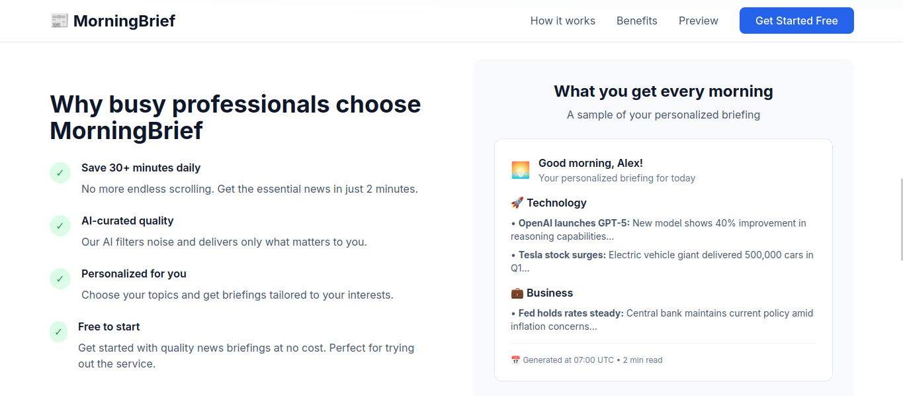
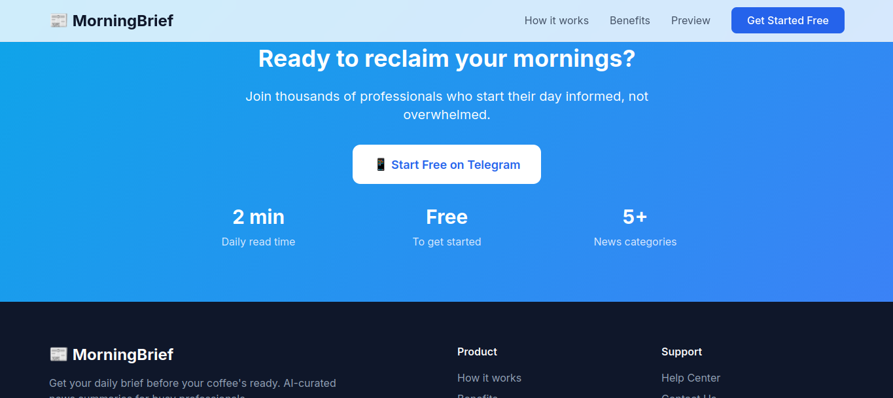
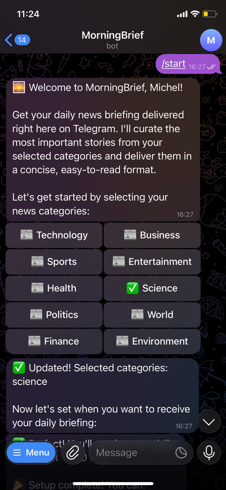
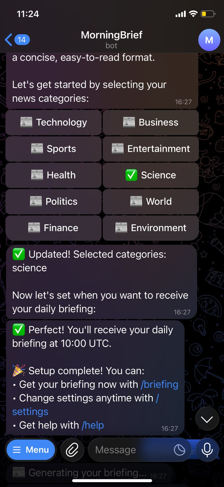

<p>
  
  
  
  
</p>

# MorningBrief

**Copyright (c) 2025 Michel Car. All rights reserved.**

A SaaS MVP that automatically generates personalized daily news briefings using ChatGPT-4o-mini via the OpenAI API.

> **⚠️ PROPRIETARY SOFTWARE**: This is commercial software protected by copyright. See [LICENSE](LICENSE) for terms.

## 🚀 Features

- **Personalized News Selection**: Choose up to 10 categories from technology, business, politics, sports, and more
- **AI-Powered Curation**: ChatGPT-4o-mini selects the most important headlines per category
- **Intelligent Summarization**: Each article is summarized into 2-3 concise sentences
- **Automated Daily Refresh**: Scheduler automatically updates news every 24 hours
- **Modern Web Interface**: Clean Streamlit dashboard for easy news consumption
- **RESTful API**: FastAPI backend with comprehensive endpoints
- **Persistent Storage**: SQLite database for storing articles and summaries

## 🏗️ Architecture

```
daily_briefing/
├── app/                    # FastAPI Backend
│   ├── main.py            # Main application
│   ├── config.py          # Configuration settings
│   ├── database.py        # Database connection
│   ├── models.py          # Data models
│   ├── routes/
│   │   └── briefing.py    # API endpoints
│   ├── services/
│   │   ├── selection.py   # News selection service
│   │   ├── summarizer.py  # Article summarization
│   │   └── scheduler.py   # Daily refresh scheduler
│   └── utils/
│       └── openai_client.py # OpenAI integration
├── frontend/
│   └── app.py             # Streamlit dashboard
├── requirements.txt       # Python dependencies
├── .env.example          # Environment variables template
└── README.md             # This file
```

## 📋 Prerequisites

- Python 3.8+
- OpenAI API key
- News API key (from newsapi.org)
- Telegram Bot Token (from @BotFather)

## 🛠️ Installation

1. **Clone or create the project directory:**
   ```bash
   mkdir daily_briefing
   cd daily_briefing
   ```

2. **Create and activate virtual environment:**
   ```bash
   python -m venv venv
   source venv/bin/activate  # On Windows: venv\Scripts\activate
   ```

3. **Install dependencies:**
   ```bash
   pip install -r requirements.txt
   ```

4. **Set up environment variables:**
   ```bash
   cp .env.example .env
   ```
   
   Edit `.env` and add your API keys:
   ```env
   OPENAI_API_KEY=your_openai_api_key_here
   NEWS_API_KEY=your_news_api_key_here
   TELEGRAM_BOT_TOKEN=your_telegram_bot_token_here
   ```

5. **Get API Keys:**
   - **OpenAI API Key**: Visit [OpenAI Platform](https://platform.openai.com/api-keys)
   - **News API Key**: Visit [NewsAPI.org](https://newsapi.org/register)
   - **Telegram Bot Token**: Message [@BotFather](https://t.me/botfather) on Telegram

## 🚀 Quick Start

### Option 1: Telegram Bot (Recommended)

1. **Setup the Telegram bot:**
   ```bash
   python setup_telegram_bot.py
   ```

2. **Start the Telegram bot:**
   ```bash
   python run_telegram_bot.py
   ```

3. **Test your bot:**
   - Open Telegram
   - Search for your bot username
   - Send `/start` command

### Option 2: Web Interface

1. **Start the backend:**
   ```bash
   python run_backend.py
   ```

2. **In a new terminal, start the frontend:**
   ```bash
   python run_frontend.py
   ```

### Option 3: Manual Start

1. **Start the FastAPI backend:**
   ```bash
   cd daily_briefing
   python -m uvicorn app.main:app --host 0.0.0.0 --port 8000 --reload
   ```

2. **Start the Streamlit frontend:**
   ```bash
   streamlit run frontend/app.py --server.port 8501
   ```

## 🤖 Telegram Bot Features

### Available Commands
- `/start` - Start using MorningBrief
- `/categories` - Select your news categories
- `/briefing` - Get your daily briefing now
- `/settings` - Manage your preferences
- `/help` - Show help information
- `/stop` - Stop receiving briefings

### How It Works
1. **Setup**: Users select their preferred news categories
2. **Schedule**: Choose when to receive daily briefings
3. **Delivery**: Get curated news summaries automatically
4. **On-demand**: Request briefings anytime with `/briefing`

### User Management
- Automatic user registration on first interaction
- Category preferences stored per user
- Customizable delivery times
- Active/inactive status tracking

## 🔧 Testing

Run the integration test to verify everything is working:

```bash
python test_integration.py
```

This will test:
- Environment configuration
- Database connectivity
- OpenAI API connection
- News API connection
- Article selection and summarization
- End-to-end workflow

## 📱 Usage

1. **Access the Dashboard**: Open http://localhost:8501 in your browser

2. **Select Categories**: Choose up to 10 news categories from the sidebar

3. **Generate Briefing**: Click "Generate Briefing" to get your personalized news summary

4. **View Results**: Articles are grouped by category with AI-generated summaries

## 🔌 API Endpoints

### Base URL: `http://localhost:8000/api/v1`

#### GET `/categories`
Returns available news categories.

**Response:**
```json
{
  "categories": ["technology", "business", "politics", ...],
  "max_categories": 10
}
```

#### POST `/briefing`
Generate a briefing for selected categories.

**Request:**
```json
{
  "categories": ["technology", "business"]
}
```

**Response:**
```json
{
  "categories": ["technology", "business"],
  "articles": [
    {
      "title": "AI Breakthrough in Healthcare",
      "url": "https://example.com/article",
      "description": "Original article description",
      "summary": "AI-generated 2-3 sentence summary",
      "category": "technology",
      "created_at": "2024-01-01T12:00:00Z"
    }
  ],
  "total_articles": 1,
  "generated_at": "2024-01-01T12:00:00Z"
}
```

#### GET `/briefing/status/{categories}`
Check briefing status for categories.

#### GET `/briefing/refresh`
Manually trigger news refresh for all categories.

## ⚙️ Configuration

Key environment variables in `.env`:

```env
# API Keys
OPENAI_API_KEY=your_openai_api_key
NEWS_API_KEY=your_news_api_key
TELEGRAM_BOT_TOKEN=your_telegram_bot_token

# Application Settings
APP_HOST=0.0.0.0
APP_PORT=8000
DEBUG=True

# Telegram Settings (Optional)
TELEGRAM_WEBHOOK_URL=https://your-domain.com/telegram/webhook
TELEGRAM_WEBHOOK_SECRET=your_webhook_secret

# Scheduler Settings
DAILY_REFRESH_HOUR=6
DAILY_REFRESH_MINUTE=0
SCHEDULER_TIMEZONE=UTC

# News Settings
MAX_CATEGORIES=10
ARTICLES_PER_CATEGORY=10
TOP_ARTICLES_PER_CATEGORY=3
```

## 🔄 How It Works

1. **Selection Process**: 
   - Fetches ~10 latest headlines per category from News API
   - Uses ChatGPT-4o-mini to select top 3 most important articles
   - Returns JSON with title, URL, and description

2. **Summarization Process**:
   - Summarizes each selected article using ChatGPT-4o-mini
   - Generates 2-3 concise sentences per article
   - Includes title, description, URL in summary

3. **Storage**:
   - Stores results in SQLite database
   - Tracks category, title, URL, summary, timestamps
   - Prevents duplicate articles

4. **Automation**:
   - APScheduler runs daily refresh at 6:00 AM UTC
   - Updates all categories automatically
   - Maintains fresh content

## 🐛 Troubleshooting

### Common Issues

1. **"No module named 'app'"**
   - Make sure you're in the `daily_briefing` directory
   - Activate your virtual environment

2. **API Key Errors**
   - Verify your `.env` file has correct API keys
   - Check OpenAI API key starts with `sk-`
   - Ensure News API key is valid

3. **No Articles Returned**
   - Check your internet connection
   - Verify News API quota hasn't been exceeded
   - Try different categories

4. **Database Errors**
   - Delete `daily_briefing.db` to reset database
   - Check file permissions in project directory

### Logs

Check application logs for detailed error information:
- Backend logs appear in the terminal running the FastAPI server
- Frontend logs appear in the Streamlit interface

## 📈 Production Deployment

For production deployment, consider:

1. **Environment Variables**:
   - Use production API keys
   - Set `DEBUG=False`
   - Configure proper database URL

2. **Database**:
   - Migrate from SQLite to PostgreSQL
   - Set up database backups

3. **Security**:
   - Add authentication/authorization
   - Use HTTPS
   - Implement rate limiting

4. **Scaling**:
   - Use Redis for caching
   - Implement horizontal scaling
   - Add monitoring and logging

## 🤝 Contributing

1. Fork the repository
2. Create a feature branch
3. Make your changes
4. Run tests: `python test_integration.py`
5. Submit a pull request

## 🆘 Support

If you encounter issues:
1. Check the troubleshooting section
2. Run the integration test: `python test_integration.py`
3. Check the logs for error messages
4. Ensure all API keys are correctly configured

## 📄 License

**PROPRIETARY SOFTWARE - ALL RIGHTS RESERVED**

This software is the exclusive property of Michel Car and is protected by copyright laws and international copyright treaties.

- **Commercial License Required**: Any commercial use requires a separate license agreement
- **No Redistribution**: You may not copy, modify, distribute, or create derivative works
- **Personal Use Only**: Limited to personal or internal business use only
- **Full Ownership**: Michel Car retains all intellectual property rights

For commercial licensing inquiries, please contact the owner.

See the [LICENSE](LICENSE) file for complete terms and conditions.

---

**Built with ❤️ using FastAPI, Streamlit, and ChatGPT-4o-mini**

Copyright (c) 2025 Michel Car. All rights reserved.
